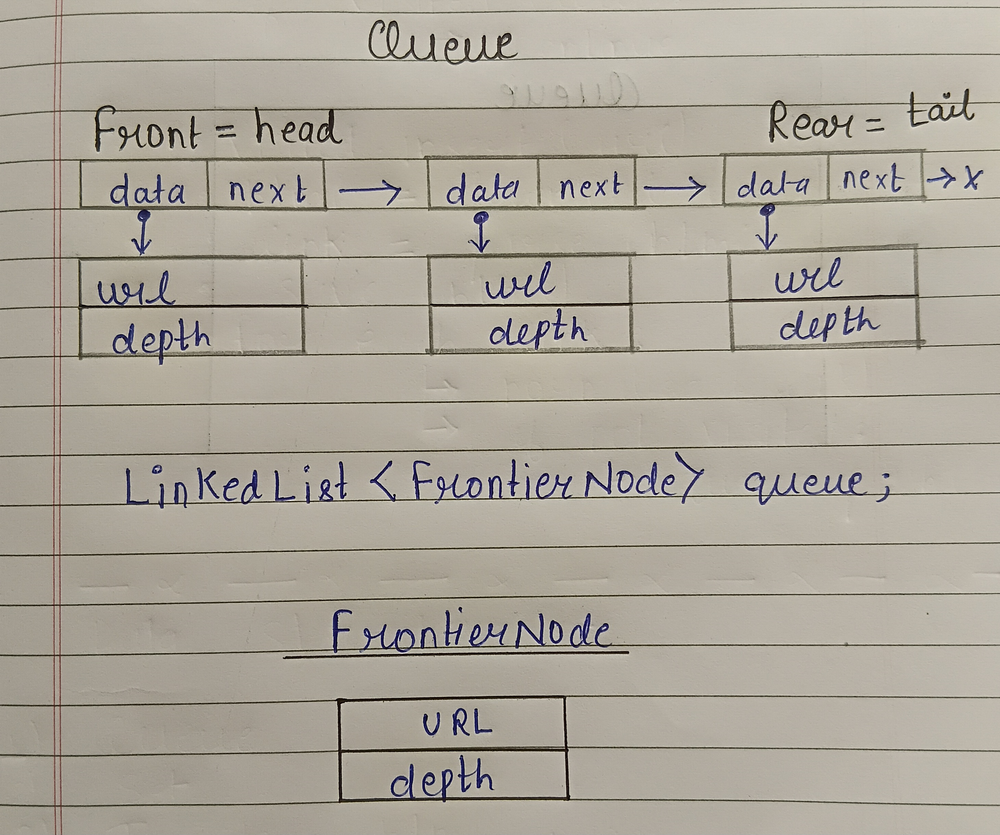
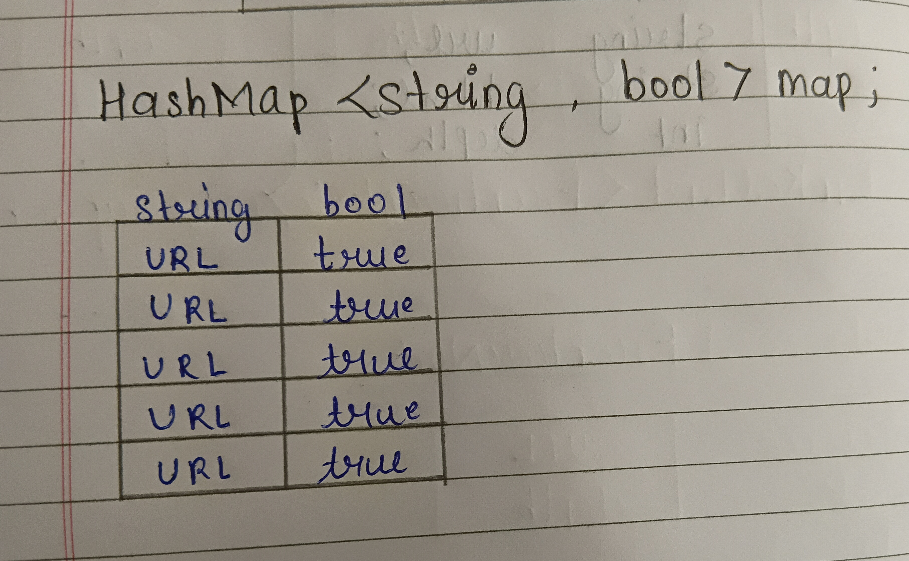
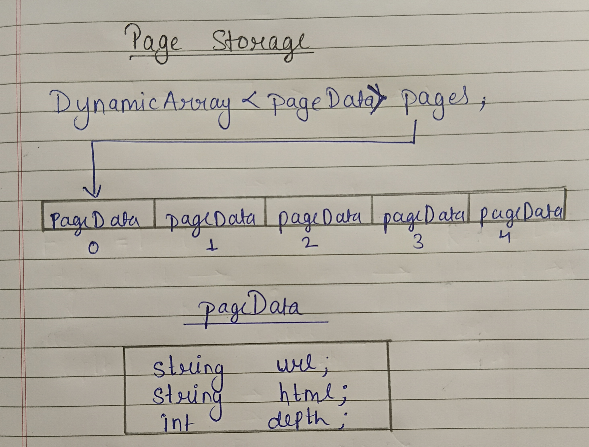

# Web Crawler Design Proposal - Version 1

## Overview

The Web Crawler recursively visits web pages starting from a seed URL, downloads their HTML content, extracts hyperlinks, and stores each downloaded page for future processing. The crawler is implemented in C++ using custom data structures such as `Queue`, `HashMap`, and `DynamicArray`, while `libcurl` is used for HTTP communication.

---

# Section 1 - Public API

The crawler is divided into independent modules to improve maintainability and allow future extensions without modifying the overall architecture.

## Frontier

```cpp
struct FrontierNode {
    string url;
    int depth;
};

class Frontier {
    private:
    LinkedList<FrontierNode>queue;
public:
    void push(const FrontierNode& node);
    FrontierNode pop();
    bool empty() const;
    int size() const;
};
```

## Downloader

```cpp
class Downloader {
public:
    string download(const string& url);
};
```

Downloads the HTML content of a webpage using libcurl.

---

## HTMLParser

```cpp
class HTMLParser {
public:
    DynamicArray<string> extractLinks(const string& html);
};
```

Extracts hyperlinks from the downloaded HTML document.

---

## PageStorage

```cpp
class PageStorage {
private:

    struct pageData{
        string url;
        string html;
        int depth;
    }
    DynamicArray<pageData>pages;
public:
    int storePage(const string& url,
                   const string& html,
                   int depth);

    string getPage(const string& url);

    bool hasPage(const string& url);
    int pageCount() const;
};
```

Stores downloaded pages and provides lookup functions required by the future Indexer project.

---


Maintains URLs waiting to be crawled.

---

## WebCrawler

```cpp
class WebCrawler {

private:
    Downloader downloader;
    HTMLParser parser;
    Frontier frontier;
    HashMap<string, bool> visitedURLs;
    PageStorage storage;

public:
    void crawl(const string& startURL);
};
```

### Design Justification

Instead of placing all functionality inside a single crawler class, responsibilities are divided into dedicated modules.

- `Downloader` handles HTTP communication.
- `HTMLParser` is responsible only for HTML parsing.
- `Frontier` manages URLs yet to be visited.
- `PageStorage` stores downloaded pages independently from crawling.
- `HashMap` prevents duplicate crawling.

This modular design improves readability, testing, and future extensibility.

---

# Section 2 - Internal Representation

## Frontier

Uses a custom Queue.



Each frontier entry stores both the URL and its crawling depth together.

---

## Visited URL Store

Uses a custom HashMap.




The HashMap provides fast duplicate detection before a page is downloaded.

---

## Page Storage

Using DynamicArray to store pages



Each page stores

- URL
- HTML Content
- Crawling Depth

---

# Section 3 - Failure Handling

### Invalid URL

The URL is rejected before downloading. The crawler skips the URL and continues with the next frontier entry.

### Duplicate URL

Before downloading, the URL is checked in the visited URL HashMap. If already present, it is ignored.

### Download Failure

If libcurl fails due to network errors or server errors, the failure is reported and crawling continues without termin#include <gtest/gtest.h>
#include "../include/Set.h"

class SetTest : public ::testing::Test
{
protected:
    Set<int> s;
};

TEST_F(SetTest, EmptySet)
{
    EXPECT_EQ(0, s.size());
}

TEST_F(SetTest, InsertOneElement)
{
    s.insert(10);

    EXPECT_TRUE(s.exists(10));
    EXPECT_EQ(1, s.size());
}

TEST_F(SetTest, InsertMultipleElements)
{
    s.insert(10);
    s.insert(20);
    s.insert(30);

    EXPECT_TRUE(s.exists(10));
    EXPECT_TRUE(s.exists(20));
    EXPECT_TRUE(s.exists(30));

    EXPECT_EQ(3, s.size());
}

TEST_F(SetTest, DuplicateInsertion)
{
    s.insert(10);
    s.insert(10);
    s.insert(10);

    EXPECT_EQ(1, s.size());
    EXPECT_TRUE(s.exists(10));
}

TEST_F(SetTest, RemoveElement)
{
    s.insert(10);
    s.insert(20);

    s.remove(10);

    EXPECT_FALSE(s.exists(10));
    EXPECT_TRUE(s.exists(20));
    EXPECT_EQ(1, s.size());
}

TEST_F(SetTest, RemoveNonExistingElement)
{
    s.insert(10);

    s.remove(50);

    EXPECT_TRUE(s.exists(10));
    EXPECT_EQ(1, s.size());
}

TEST_F(SetTest, ExistsForMissingElement)
{
    EXPECT_FALSE(s.exists(100));
}

TEST_F(SetTest, GetAllElements)
{
    s.insert(5);
    s.insert(10);
    s.insert(15);

    DynamicArray<int> values = s.getAll();

    EXPECT_EQ(3, values.size());

    EXPECT_TRUE(
        values.exists(5)
    );

    EXPECT_TRUE(
        values.exists(10)
    );

    EXPECT_TRUE(
        values.exists(15)
    );
}

TEST_F(SetTest, ClearSet)
{
    s.insert(1);
    s.insert(2);
    s.insert(3);

    s.clear();

    EXPECT_EQ(0, s.size());
    EXPECT_FALSE(s.exists(1));
    EXPECT_FALSE(s.exists(2));
    EXPECT_FALSE(s.exists(3));
}

TEST_F(SetTest, StringSet)
{
    Set<std::string> names;

    names.insert("Alice");
    names.insert("Bob");

    EXPECT_TRUE(names.exists("Alice"));
    EXPECT_TRUE(names.exists("Bob"));

    names.remove("Alice");

    EXPECT_FALSE(names.exists("Alice"));
    EXPECT_TRUE(names.exists("Bob"));
}ating the program.

### Malformed HTML

The parser extracts all valid hyperlinks that can be identified. Invalid HTML is skipped gracefully without crashing.

### Empty Page

Empty HTML documents are still stored in Page Storage, but no hyperlinks are extracted.

---

# Section 4 - Complexity Analysis

## Frontier

The Frontier maintains the list of URLs waiting to be crawled. It is implemented using a custom queue backed by a linked list, allowing efficient insertion and removal of URLs.

| Operation | Best Case | Average Case | Worst Case | Reason |
|-----------|:---------:|:------------:|:----------:|--------|
| `push()` | O(1) | O(1) | O(1) | Inserts a new `FrontierNode` at the rear of the queue. |
| `pop()` | O(1) | O(1) | O(1) | Removes the front element without traversing the queue. |
| `empty()` | O(1) | O(1) | O(1) | Checks whether the queue contains any elements. |
| `size()` | O(1) | O(1) | O(1) | Returns the maintained number of elements. |

---

## Downloader

The Downloader uses **libcurl** to fetch HTML documents from the web server. Since the complete response must be received before returning, the running time depends on the size of the downloaded page.

| Operation | Best Case | Average Case | Worst Case | Reason |
|-----------|:---------:|:------------:|:----------:|--------|
| `download()` | O(n) | O(n) | O(n) | Downloads the complete HTML response from the server. The complexity depends on the size of the downloaded document. |

---

## HTMLParser

The HTML Parser scans the downloaded HTML document and extracts hyperlinks. Every character of the document is processed at most once.

| Operation | Best Case | Average Case | Worst Case | Reason |
|-----------|:---------:|:------------:|:----------:|--------|
| `extractLinks()` | O(n) | O(n) | O(n) | Performs a linear scan of the HTML document to identify hyperlinks. |

---

## Visited URL Store

Visited URLs are maintained using a custom **HashMap**. Before downloading any page, the crawler checks whether the URL has already been visited.

| Operation | Best Case | Average Case | Worst Case | Reason |
|-----------|:---------:|:------------:|:----------:|--------|
| `exists()` | O(1) | O(1) | O(n) | Hash lookup is constant on average. Excessive collisions require traversing an entire bucket. |
| `insert()` | O(1) | O(1) | O(n) | Inserts a URL into the appropriate bucket. Rehashing or many collisions increase the running time. |


`n` represents the size of html page.


---

## Page Storage

Downloaded pages are stored inside a `DynamicArray<pageData>`, where each entry stores the URL, HTML content, and crawling depth.

| Operation | Best Case | Average Case | Worst Case | Reason |
|-----------|:---------:|:------------:|:----------:|--------|
| `storePage()` | O(1) | O(1) | O(n) | Appends a page to the DynamicArray. During resizing, all existing pages are copied into a larger array. |
| `getPage()` | O(n) | O(n) | O(n) | Searches for the requested URL by traversing all stored pages. |
| `hasPage()` | O(n) | O(n) | O(n) | Performs a linear search to determine whether a page with the given URL exists. |
| `pageCount()` | O(1) | O(1) | O(1) | Returns the maintained number of stored pages. |


`n` represents the size of html page.


---


# Section 5 - Future Compatibility


The crawler is designed using a modular architecture so that the downloaded pages can be reused directly by the **Indexer** in the next project without modifying the crawling logic.

A dedicated **PageStorage** module is used to manage all downloaded pages. Instead of storing page data inside the crawler itself, every downloaded page is stored independently along with its URL, HTML content, and crawling depth. This separation allows the crawler to focus only on collecting web pages, while future components can process the stored data without depending on the crawler's implementation.

The `PageStorage` module exposes the following interface:

```cpp
int storePage(const std::string& url,
              const std::string& html,
              int depth);

std::string getPage(const std::string& url);

bool hasPage(const std::string& url);

int pageCount() const;
```

### Compatibility with the Indexer

The Indexer only requires access to the downloaded HTML pages and does not need to know how they were crawled. The stored pages can be retrieved using their URL, while `pageCount()` provides the total number of pages collected during crawling.


This design keeps the crawler and the indexer independent of each other. Future improvements such as storing additional metadata (page title, HTTP status code, content type, timestamps, etc.), compressing HTML pages, or replacing the underlying storage implementation can be made inside the `PageStorage` module without affecting the crawler or the indexer.