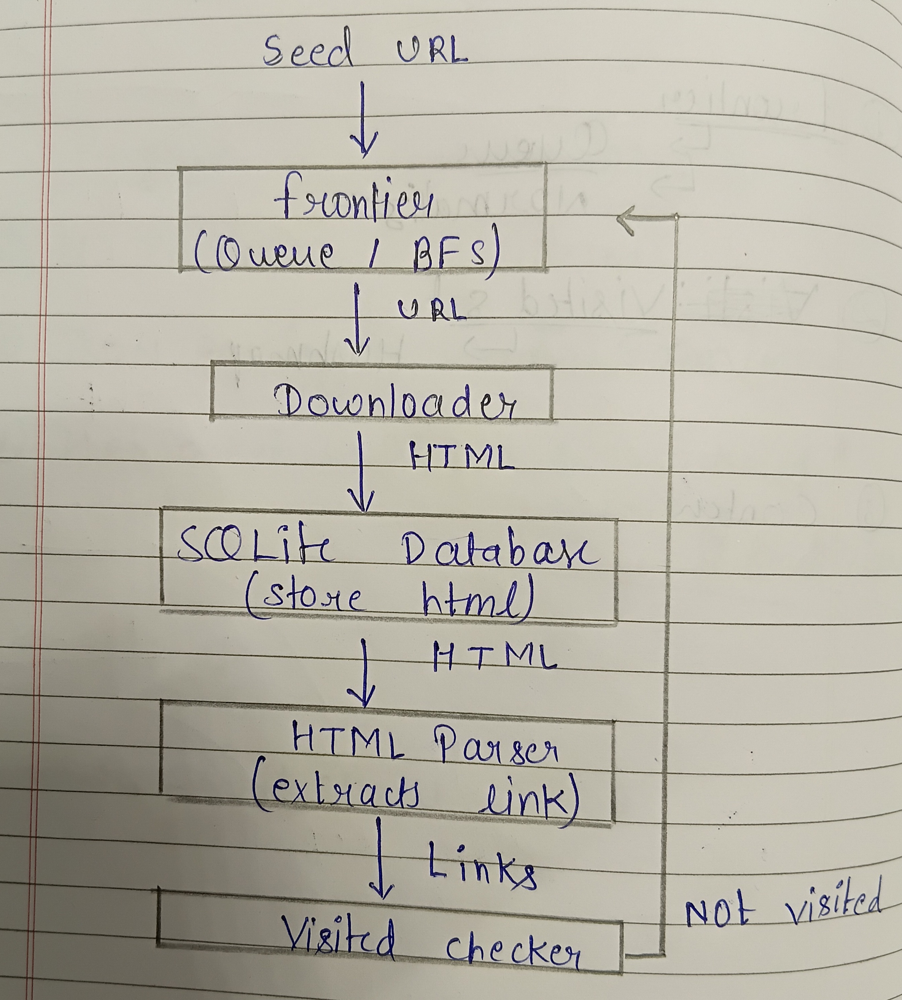
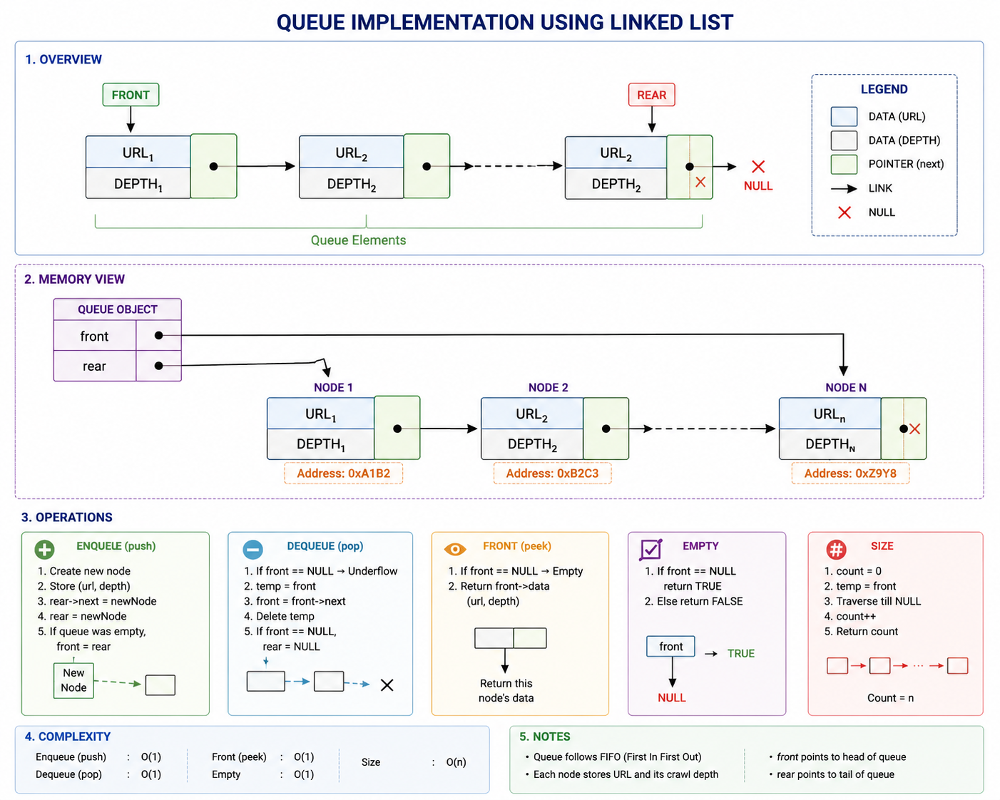
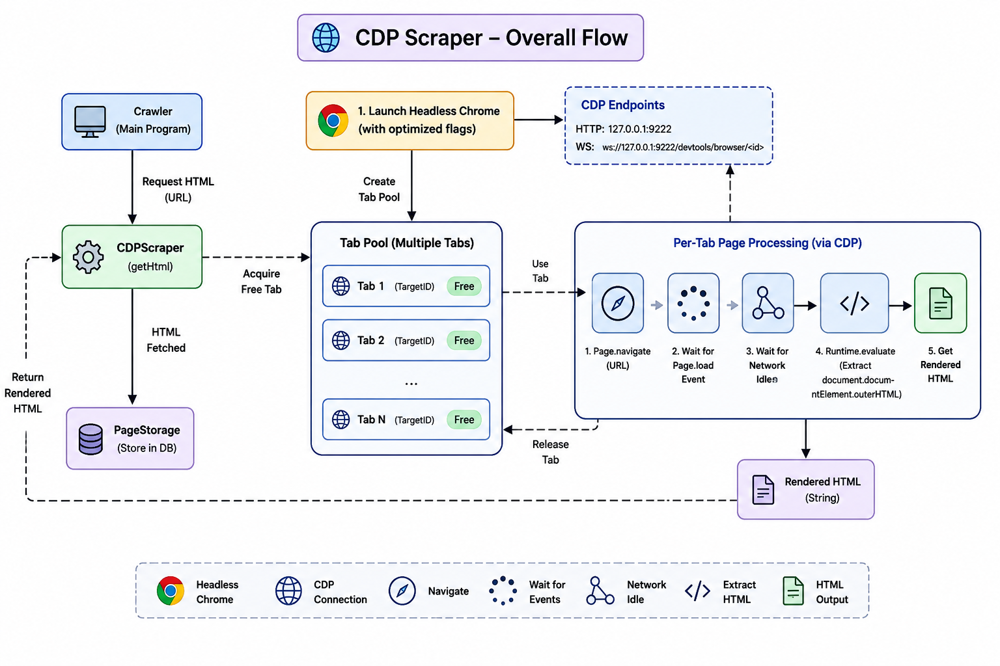
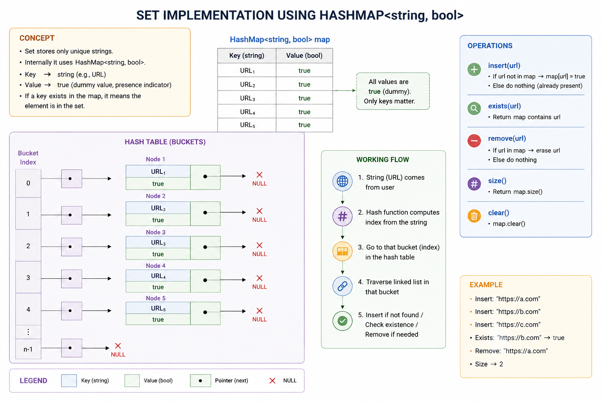

# Web Crawler Design Proposal - Version 3

## Overview

The Web Crawler recursively visits web pages starting from a seed URL, renders and downloads their HTML content, extracts hyperlinks, and stores each downloaded page for future processing.

The crawler is implemented in C++ using custom data structures such as `Queue`, `HashMap`, and `DynamicArray`. Modern web pages are rendered using **Chrome DevTools Protocol (CDP)**, allowing the crawler to process both static and JavaScript-based websites.

---

## Architecture - Web crawler



# Section 1 - Public API

The crawler is divided into independent modules to improve maintainability and allow future extensions without modifying the overall architecture.

## Crawler

```cpp
class Crawler
class Crawler{
    private:
    int depth;
    Frontier frontier;
    Normalizer normalizer;
    CDPScraper fetch;
    HtmlParser htmlparser;
    Database database;

    public:
    Crawler();
    void crawl(string seed,int deep);

};
```

Coordinates the complete crawling process by downloading pages, parsing links, managing the frontier, and storing downloaded pages.

---

## Frontier

```cpp
class Frontier{

    struct URL{
        string link;
        int depth;
        string lastCrawl;
    };
    string getDate();
    Queue<URL>queue;
    
    public:
    void put(string& link,int depth);
    URL pop();
    bool empty();
    string getLink();
    int getDepth();
};
```

Maintains URLs waiting to be crawled using a FIFO queue. Before inserting a URL into the queue, it is normalized to ensure a consistent representation and reduce duplicate URLs caused by different URL formats.

---

## Downloader

```cpp
class CDPScraper
{
public:
    string getHtml(string url);
};
```

Uses **Chrome DevTools Protocol (CDP)** to launch a headless Chrome instance, render the webpage, execute JavaScript, and return the fully rendered HTML.

---

## HTMLParser

```cpp
class HtmlParser{
    private:
    DynamicArray<string>links;
    public:
    size_t parseHttp(string part);
    size_t parseHref(string part);
    DynamicArray<string>parseHtml(string html);

};

```

Extracts hyperlinks from the rendered HTML document.

---

## PageStorage

```cpp
class PageStorage
{
private:
    Database d;

public:
    PageStorage();

    bool storePage(string &url,
                   string &html,
                   int depth);

    bool getPage(string &url,
                 int &depth,
                 string &html,
                 string &lastCrawl);

    string getHtml(string &url);

    int getDepth(string &url);

    string getLastCrawl(string &url);
};
```

Stores rendered webpages in an SQLite database. Each record contains the URL, rendered HTML, and crawling depth. Using SQLite provides persistent storage, allowing downloaded pages to be reused by future modules even after the crawler terminates.

---

## Design Justification

Instead of placing all functionality inside a single crawler class, responsibilities are divided into dedicated modules.

- `Crawler` coordinates the crawling process.
- `Downloader` handles webpage rendering using Chrome DevTools Protocol (CDP).
- `HTMLParser` extracts hyperlinks from rendered HTML.
- `Frontier` manages URLs waiting to be crawled and normalizes URLs before insertion to maintain a consistent crawling queue.
- `PageStorage` stores downloaded pages independently from the crawler.
- `HashMap` prevents duplicate crawling.

The modular design improves readability, testing, and future extensibility. Since browser-specific functionality is isolated inside the `Downloader`, a different rendering engine can be adopted later without modifying the remaining components.

---

# Section 2 - Internal Representation

## Frontier

Uses a custom Queue.



The queue stores URLs in FIFO order.

---

## Downloader

Uses **Chrome DevTools Protocol (CDP)** to communicate with a headless Chrome browser.



This enables crawling of JavaScript-heavy websites where the original HTTP response does not contain the complete page content.

---

## Visited URL Store

Uses a custom HashMap.



The HashMap provides fast duplicate detection before downloading a page.

---

## Page Storage

Uses an **MySQL** database for persistent storage.

Each database record contains:

- URL
- Rendered HTML
- Crawling Depth

MtSQL preserves downloaded pages across multiple executions and provides efficient retrieval based on the stored URL.

---

# Section 3 - Failure Handling

## Invalid URL

Invalid URLs are skipped and the crawler continues processing the remaining URLs.

---

## Duplicate URL

Before downloading a page, the crawler checks the HashMap. Already visited URLs are ignored.

---

## Browser Launch Failure

If Chrome cannot be launched or a CDP connection cannot be established, the crawler reports the error and continues crawling.

---

## Page Rendering Timeout

If page rendering exceeds the timeout limit, the page is skipped and crawling continues.

---

## Malformed HTML

The parser extracts all valid hyperlinks that can be identified. Invalid HTML is ignored without terminating the crawler.

---

## Empty Page

Empty HTML documents are stored successfully, although no hyperlinks are extracted.

---

# Section 4 - Complexity Analysis

## Frontier

Implemented using a custom **Queue**.

| Operation | Best | Average | Worst | Reason |
|-----------|:----:|:-------:|:-----:|--------|
| `push()` | O(1) | O(1) | O(1) | Inserts a URL at the rear of the queue. |
| `pop()` | O(1) | O(1) | O(1) | Removes the URL from the front of the queue. |
| `front()` | O(1) | O(1) | O(1) | Returns the front URL without removing it. |
| `empty()` | O(1) | O(1) | O(1) | Checks whether the frontier is empty. |
| `size()` | O(1) | O(1) | O(1) | Returns the maintained queue size. |

---

## Downloader (Chrome DevTools Protocol)

| Operation | Best | Average | Worst | Reason |
|-----------|:----:|:-------:|:-----:|--------|
| `fetchPage()` | O(n) | O(n) | O(n) | Time depends on downloading and rendering the HTML document, where *n* is the size of the rendered HTML. |

---

## HTML Parser

| Operation | Best | Average | Worst | Reason |
|-----------|:----:|:-------:|:-----:|--------|
| `parseHtml()` | O(n) | O(n) | O(n) | Performs a single linear scan of the rendered HTML document to extract hyperlinks. |

---

## URL Normalizer

| Operation | Best | Average | Worst | Reason |
|-----------|:----:|:-------:|:-----:|--------|
| `normalize()` | O(m) | O(m) | O(m) | Processes each URL by removing fragments, resolving paths, checking ignored domains/extensions, and normalizing the URL. **Here *m* is the length of the URL.** |

---

## Visited URL Store

Implemented using a custom **HashMap**.

| Operation | Best | Average | Worst | Reason |
|-----------|:----:|:-------:|:-----:|--------|
| `exists()` | O(1) | O(1) | O(n) | Average constant-time lookup; excessive collisions degrade performance. |
| `insert()` | O(1) | O(1) | O(n) | Rehashing or heavy collisions may increase runtime. |

---

## Page Storage (MySQL)

| Operation | Best | Average | Worst | Reason |
|-----------|:----:|:-------:|:-----:|--------|
| `storePage()` | O(log n) | O(log n) | O(n) | Inserts a crawled page into the MySQL database using the indexed URL field. |
| `getPage()` | O(log n) | O(log n) | O(n) | Retrieves the stored HTML corresponding to a URL. |
| `getDepth()` | O(log n) | O(log n) | O(n) | Retrieves the crawl depth for a stored page. |
| `getLastCrawl()` | O(log n) | O(log n) | O(n) | Retrieves the last crawl timestamp associated with a URL. |
| `hasPage()` | O(log n) | O(log n) | O(n) | Checks whether a page corresponding to the given URL exists in the database. |

---

## Overall Crawling

For each webpage, the crawler performs:

1. Download and render the webpage using Chrome DevTools Protocol.
2. Parse the rendered HTML to extract hyperlinks.
3. Normalize every extracted URL.
4. Check for duplicates using the visited URL store.
5. Store the crawled page in the MySQL database.

If a webpage contains **k** hyperlinks and the rendered HTML size is **n**, the overall processing time for one page is approximately:

\[
O(n + k)
\]

where:

- **n** = size of the rendered HTML document.
- **k** = number of hyperlinks extracted from that document.

---

# Section 5 - Future Compatibility

The crawler is designed using a modular architecture so that future components can be integrated without modifying the core crawling logic. Responsibilities such as page downloading, URL normalization, HTML parsing, and page storage are separated into independent modules, making the system easier to extend, test, and maintain.

The **PageStorage** module acts as an abstraction over the database layer. It stores every crawled webpage in a **MySQL** database together with its URL, rendered HTML, crawl depth, and the last crawl date. Since other modules communicate only through the `PageStorage` interface, the underlying storage implementation can be replaced without affecting the crawler.

The current `PageStorage` interface is shown below.

```cpp
bool storePage(std::string &url,
               std::string &html,
               int depth);

std::string getPage(std::string &url);

int getDepth(std::string &url);

std::string getLastCrawl(std::string &url);

bool hasPage(std::string &url);
```

## Compatibility with the Indexer

The crawler stores fully rendered HTML pages after JavaScript execution using **Chrome DevTools Protocol (CDP)**. As a result, an Indexer can directly consume the stored pages without requiring a browser or JavaScript execution. This enables the Indexer to process both static and dynamic websites using the same interface.

## Future Enhancements

The current design allows several future improvements without changing the crawler architecture:

- Incremental crawling using the `last_crawl` field to avoid downloading recently crawled pages.
- Configurable recrawling policies based on page freshness.
- Storage of additional metadata such as HTTP status code, response headers, page title, canonical URL, content type, and crawl duration.
- Support for alternative storage backends such as SQLite, PostgreSQL, or distributed databases by modifying only the `PageStorage` implementation.
- Parallel and distributed crawling using multiple worker threads or crawler instances.
- Integration with indexing, ranking, duplicate page detection, and search modules using the stored webpage database.

The modular design ensures that future components can be added with minimal changes to the existing implementation while maintaining clear separation of responsibilities.